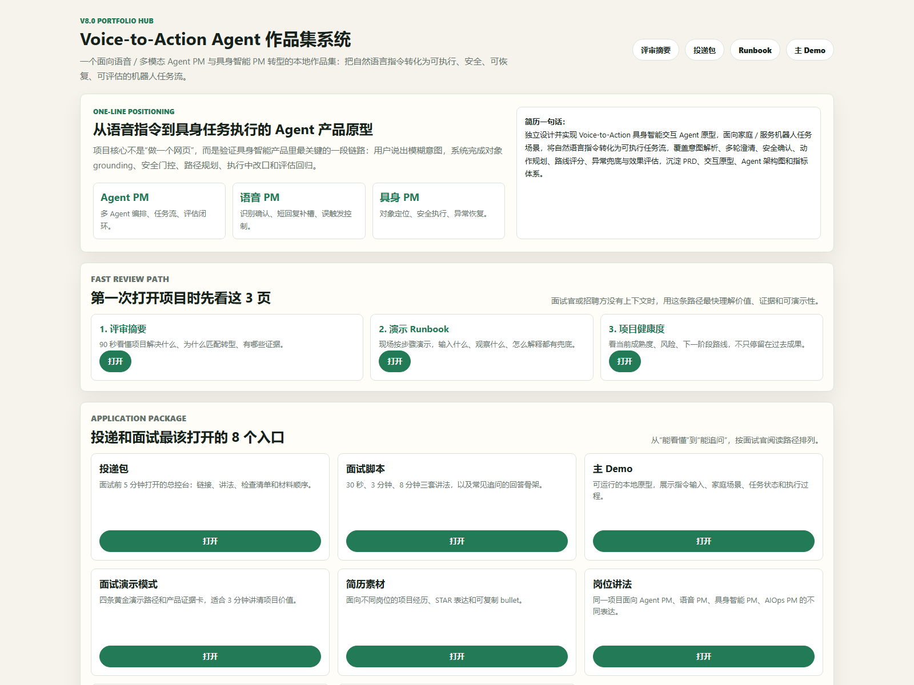
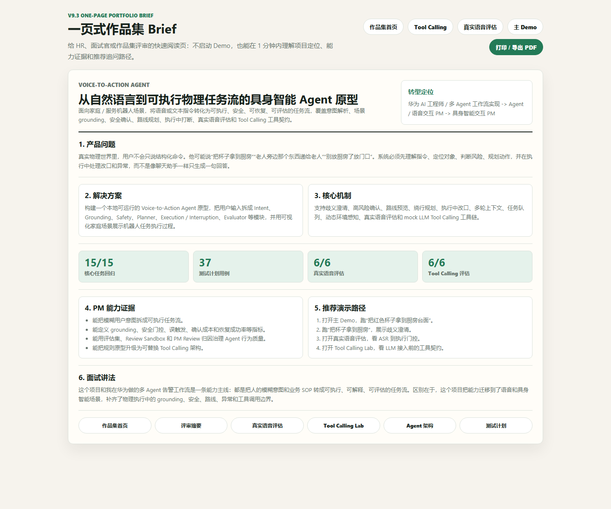
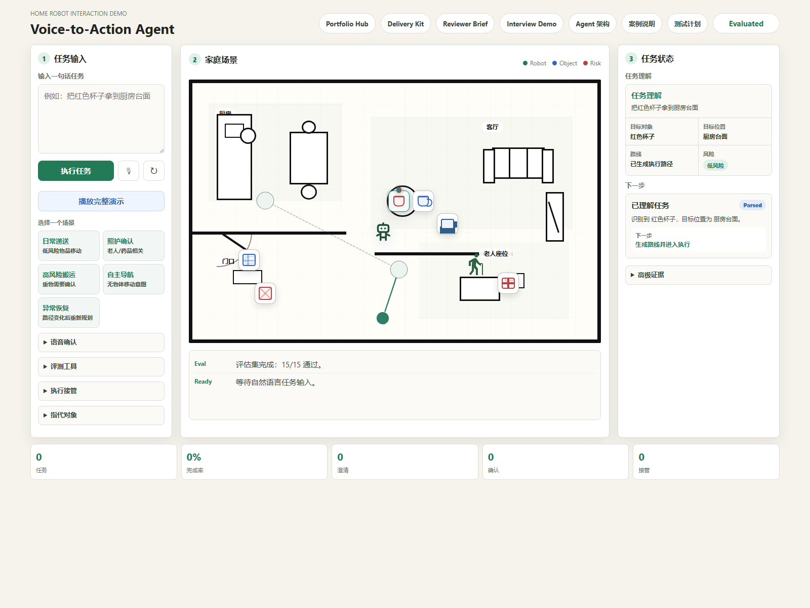
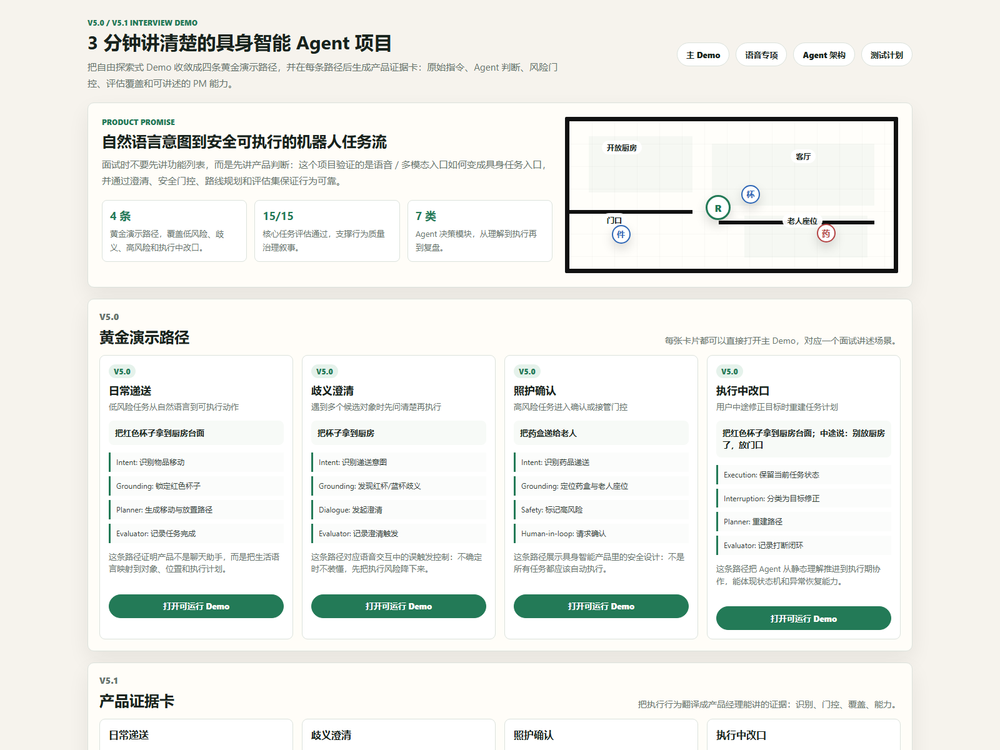
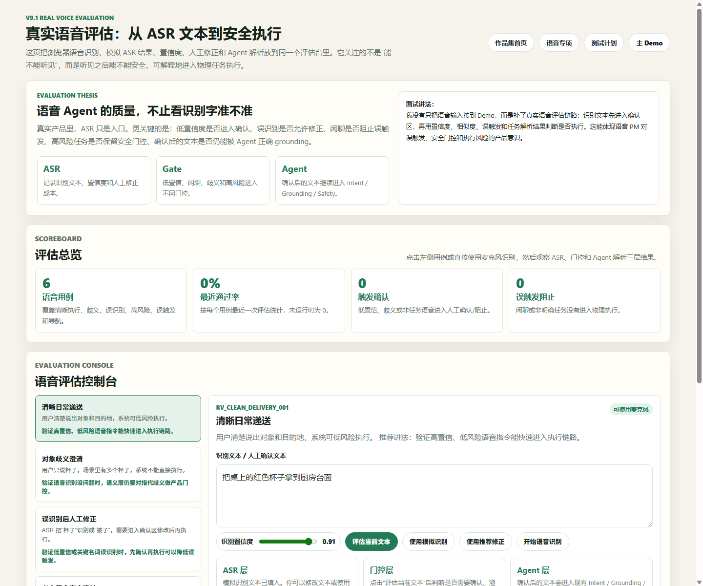
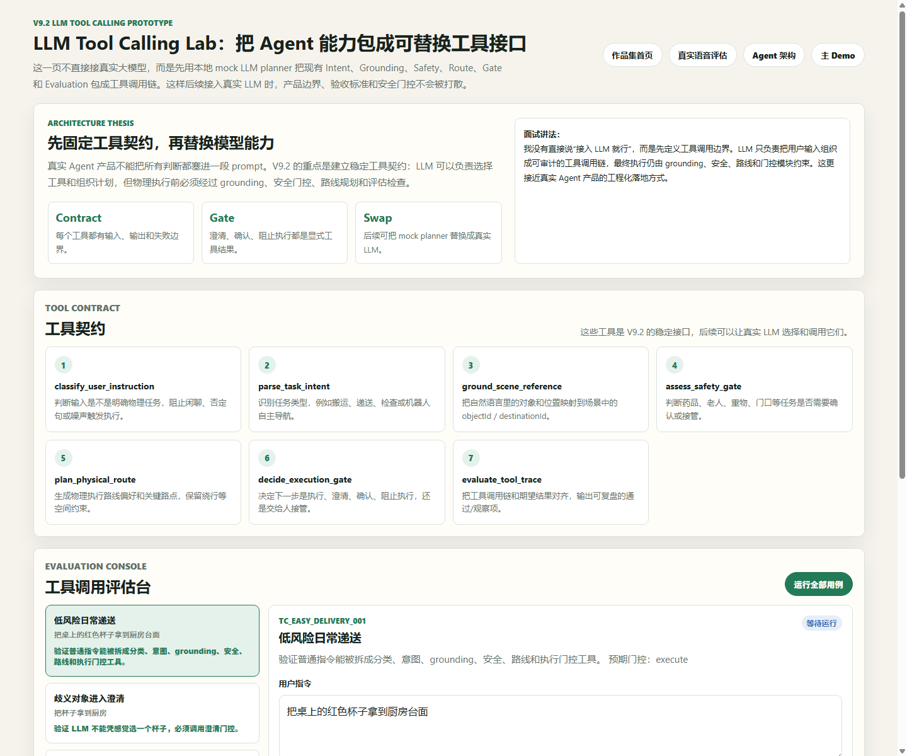
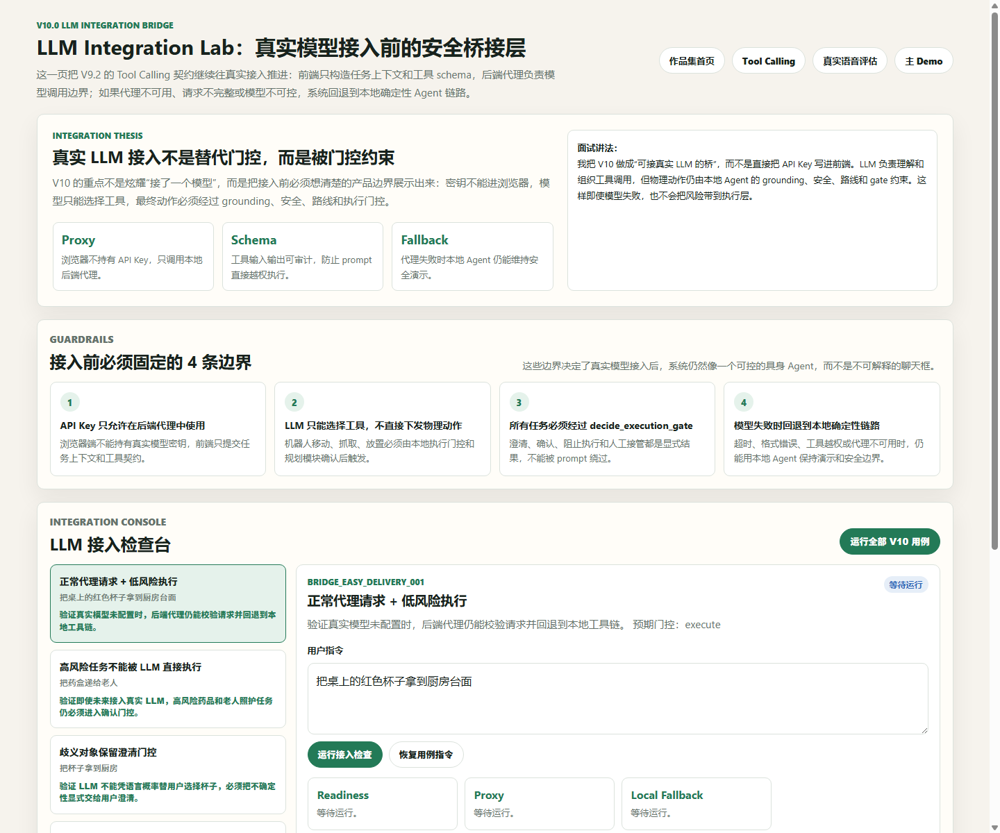
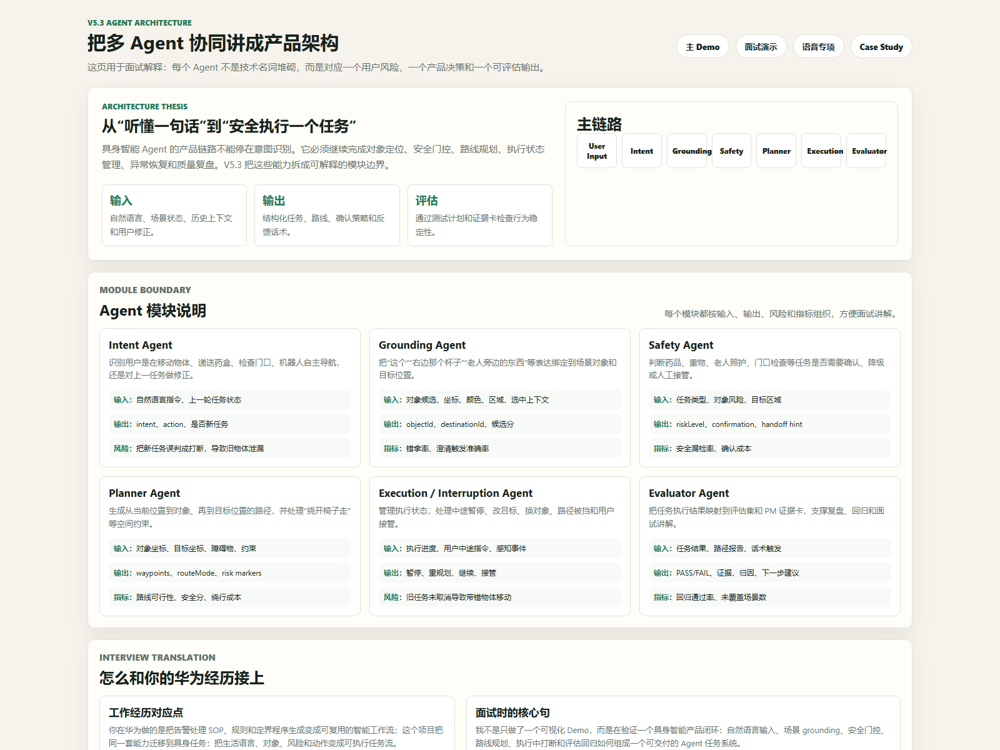

# Voice-to-Action Agent

一个面向具身智能转型作品集的本地原型项目：把用户的语音或文本指令转化为可执行的物理世界任务流，并展示澄清、安全确认、动作规划、异常兜底和指标评估。

## GitHub Showcase

这是一个面向 Agent PM、语音交互 PM 和具身智能 PM 转型的作品集项目。它重点展示“自然语言意图 -> Agent 编排 -> 物理任务计划 -> 安全执行 -> 评估复盘”的完整产品链路。

推荐第一次打开时按这个顺序阅读：

1. `portfolio-hub.html`：作品集统一入口。
2. `portfolio-brief.html`：一页式作品集 Brief，可打印或导出 PDF。
3. `reviewer-brief.html`：面试官 90 秒评审摘要。
4. `interview-demo.html`：四条黄金演示路径。
5. `real-voice-eval.html`：真实语音评估一期。
6. `tool-calling-lab.html`：LLM Tool Calling 原型。
7. `llm-integration-lab.html`：LLM 接入桥，展示后端代理、安全边界和本地兜底。
8. `agent-architecture.html`：Agent 模块边界和指标。
9. `test-plan.html`：回归测试和 PM Review。

## Screenshots

















## Why This Project

这个项目服务于“语音/多模态 Agent PM -> 机器人/具身智能交互 PM”的职业路线。它不是普通聊天助手，而是强调：

- 从自然语言意图到可执行任务
- 多轮澄清和安全确认
- Agent 编排与任务状态可视化
- 机器人场景中的反馈、异常和接管
- 可复盘的产品指标体系

## Run Locally

```powershell
cd D:\voice-to-action-agent
python server.py
```

然后打开：

```text
http://localhost:8765
```

作品集统一入口：

```text
http://localhost:8765/portfolio-hub.html
```

一页式作品集 Brief：

```text
http://localhost:8765/portfolio-brief.html
```

作品集 Case Study 页面：

```text
http://localhost:8765/portfolio.html
```

真实语音评估页面：

```text
http://localhost:8765/real-voice-eval.html
```

LLM Tool Calling 原型页面：

```text
http://localhost:8765/tool-calling-lab.html
```

LLM 接入桥页面：

```text
http://localhost:8765/llm-integration-lab.html
```

## Project Structure

```text
D:\voice-to-action-agent
├── index.html
├── portfolio.html
├── test-plan.html
├── version-history.html
├── voice-script.html
├── interview-demo.html
├── voice-lab.html
├── agent-architecture.html
├── portfolio-hub.html
├── portfolio-brief.html
├── delivery-kit.html
├── interview-script.html
├── resume-pack.html
├── demo-video-script.html
├── reviewer-brief.html
├── demo-runbook.html
├── project-health.html
├── real-voice-eval.html
├── tool-calling-lab.html
├── llm-integration-lab.html
├── role-positioning.html
├── decision-log.html
├── evidence-dashboard.html
├── src
│   ├── agent-orchestrator.js
│   ├── app.js
│   ├── interview-demo.js
│   ├── real-voice-eval.js
│   ├── tool-calling-prototype.js
│   ├── tool-calling-lab.js
│   ├── llm-integration-bridge.js
│   ├── llm-integration-lab.js
│   ├── portfolio.css
│   ├── test-plan.css
│   ├── test-plan.js
│   ├── v5-pages.css
│   ├── voice-script.css
│   ├── version-history.css
│   └── styles.css
├── data
│   ├── scenarios.json
│   ├── interview-demo-flows.json
│   ├── evaluation-set.json
│   ├── interruption-evaluation-set.json
│   ├── voice-feedback-evaluation-set.json
│   ├── route-evaluation-set.json
│   ├── real-voice-evaluation-set.json
│   ├── tool-calling-evaluation-set.json
│   └── llm-integration-evaluation-set.json
└── docs
    ├── agent-orchestration.md
    ├── case-study.md
    ├── demo-links.md
    ├── github-readme.md
    ├── github-publish-checklist.md
    ├── video-outline.md
    ├── reviewer-brief.md
    ├── demo-runbook.md
    ├── project-health.md
    ├── real-voice-evaluation.md
    ├── tool-calling-prototype.md
    ├── llm-integration-bridge.md
    ├── portfolio-one-page-brief.md
    ├── interview-guide.md
    ├── product-decisions.md
    ├── resume-project.md
    ├── demo-script.md
    ├── failure-recovery.md
    ├── user-interruption.md
    ├── voice-feedback.md
    ├── voice-feedback-evaluation.md
    ├── route-evaluation.md
    ├── voice-interaction-script.md
    ├── multimodal-grounding.md
    ├── PRD.md
    ├── architecture.md
    ├── metrics.md
    └── roadmap.md
```

## Current Scope

- 文本输入，浏览器支持时可用语音输入
- 家庭/服务机器人 2D 场景
- 多 Agent 编排：Intent、Grounding、Safety、Planner、Evaluator
- 场景语义 grounding：颜色、区域、左右、旁边、选中对象上下文
- 歧义对象澄清
- 高风险动作确认
- 异常恢复预案：路径阻塞、药品递送、避障恢复、人工接管
- 执行路径预览：路线 overlay、分段路径、预计距离/耗时、路径风险标记
- 执行中路线重规划：识别“绕开椅子走”等空间约束并加入绕行点
- 执行中用户打断：暂停、改目标位置、换目标对象、路线重规划、人工接管
- 机器人语音反馈：理解、澄清、安全确认、执行、恢复、打断和接管话术
- 语音交互脚本：把核心任务、澄清、安全、恢复、改口和接管沉淀成可复盘话术
- 路线质量评估：验证路径分段、绕行点、风险标记、策略标签和无物体导航的路线报告
- 路线评分与对比：展示安全分、效率分、可行性分、风险暴露、绕行成本和默认/绕行路线推荐
- PM Review 复盘模式：把失败或高风险观察样本归因到产品定义、Grounding、安全门控、路线规划、路线评分、执行状态机或话术策略
- 失败注入 / Review Sandbox：在不破坏真实 100% 回归基线的前提下，模拟错拿对象、路线低分、安全漏检和旧任务泄漏事故
- 多轮上下文管理：识别新任务、补充澄清、确认、取消、修正上一任务、连续任务和执行中打断
- 任务队列与优先级：把“先 A，再 B”拆成顺序队列，展示当前、等待、完成、取消和安全门控任务
- 动态环境感知：模拟目标被挪走、路径被挡住、老人位置变化，并触发重定位、重规划或恢复流程
- 语音交互控制台：展示听取、识别确认、理解、澄清、确认、执行、恢复、完成等语音状态机
- 语音识别确认区：语音结果先进入可编辑确认区，用户确认后再执行，降低误识别直接触发任务的风险
- 真实语音评估：记录 ASR 文本、置信度、人工修正、误触发阻止和确认后 Agent 解析结果
- LLM Tool Calling 原型：把 Intent、Grounding、Safety、Route、Gate 和 Evaluation 包成可替换工具接口
- LLM 接入桥：通过后端代理 dry-run 展示真实模型接入边界、请求校验、本地确定性兜底和执行门控
- 一页式作品集 Brief：把项目定位、能力证据、演示路径和面试讲法压缩成可打印材料
- 语音 PM Demo 模式：一键串联歧义澄清、高风险确认、中途改口和动态环境恢复四段面试演示
- 分步任务计划和执行时间线
- 任务完成率、澄清率、确认率、接管率、异常率等指标
- 评估集回归：15 条核心任务流，用于展示产品经理对 Agent 行为稳定性的验证意识
- 打断评估回归：7 条执行中动态意图用例，用于验证改口、暂停、换对象、路线重规划和接管稳定性
- 语音反馈评估：7 条话术触发用例，用于验证理解、澄清、确认、恢复、改口、绕行和接管反馈
- 路线质量评估：4 条路径报告用例，用于验证 direct / avoid_chair / navigation / elder handoff 路线质量、路线评分和推荐路线
- 测试计划页：33 条用例 expected vs actual 回放，用于面试讲解产品质量治理
- 版本演进页：把 V1.0-V3.2 串成产品问题、关键优化、PM 能力和证据链

## Debug URLs

```text
http://localhost:8765/?eval=1
http://localhost:8765/?interrupteval=1
http://localhost:8765/?voiceeval=1
http://localhost:8765/?routeeval=1
http://localhost:8765/portfolio-brief.html
http://localhost:8765/real-voice-eval.html
http://localhost:8765/tool-calling-lab.html
http://localhost:8765/llm-integration-lab.html
http://localhost:8765/test-plan.html?sandbox=grounding_wrong_object
http://localhost:8765/test-plan.html?sandbox=route_score_regression
http://localhost:8765/test-plan.html?sandbox=safety_gate_missing
http://localhost:8765/test-plan.html?sandbox=execution_state_leak
http://localhost:8765/?demo=把杯子拿到厨房&interrupt=红色的
http://localhost:8765/?demo=先把红色杯子拿到厨房，再请你移动到客厅
http://localhost:8765/?demo=把红色杯子拿到厨房&perception=path_blocked
http://localhost:8765/test-plan.html
http://localhost:8765/case-study-v4.html
http://localhost:8765/version-history.html
http://localhost:8765/voice-script.html
http://localhost:8765/?demo=把桌上的红色杯子拿到厨房台面
http://localhost:8765/?demo=把右边那个杯子拿到厨房台面
http://localhost:8765/?confirm=1&demo=把重箱子搬到门口
http://localhost:8765/?demo=把重箱子搬到门口，绕开椅子走
http://localhost:8765/?confirm=1&demo=把重箱子搬到门口&interrupt=绕开椅子走
http://localhost:8765/?demo=把红色杯子拿到厨房台面&interrupt=别放厨房了，放门口
http://localhost:8765/?voicedemo=1
```

## V3.4 Update

- 新增 `data/advanced-interaction-evaluation-set.json`，把多轮澄清、多轮确认、任务队列和动态感知纳入测试计划回归。
- `test-plan.html` 新增“高级交互”分组，当前真实回归基线为 37 条用例，基础 15/15、打断 7/7、语音 7/7、路线 4/4、高级交互 4/4，总通过率 100%。
- 每个测试详情新增 `PM Demo Guide`，自动把单条用例转成产品问题、观察证据、决策口径、下一步指标和 60 秒面试讲解词。
- 这一步把项目从“能演示功能”继续推进到“能讲清楚为什么这个功能对语音/具身智能 PM 有价值”。

## V3.5 Update

- 主 Demo 右侧新增 `Quality Evidence / PM 讲解` 面板。
- 当前运行任务会自动匹配基础、语音、路线或高级交互评测用例，并显示“已纳入回归”或“建议补充用例”。
- 面板把实时 Demo 行为转成产品问题、证据、决策口径、下一步指标和面试讲解词。
- 这一步把 `index.html` 的现场演示和 `test-plan.html` 的质量治理打通，演示时可以边跑任务边讲清楚评测证据。

## V3.6 Update

- 主 Demo 左侧新增 `V3.6 语音交互控制台`。
- Web Speech API 识别结果不再直接执行，而是先进入“语音识别确认区”，用户可修改后点击“使用并执行”。
- 新增语音状态机可视化：空闲、听取、确认识别、理解、澄清、确认、执行、恢复、完成。
- 新增语音交互指标：识别轮次、确认执行、人工修正、兜底次数、识别置信和输入来源。
- 新增 `运行语音 PM Demo` 按钮和 `?voicedemo=1` URL，一键演示澄清、安全确认、执行中改口和动态环境恢复。

## V3.7-V4.0 Update

- V3.7 新增 `data/voice-interaction-evaluation-set.json`，把识别确认、修正后执行、语音兜底、短回复澄清、短回复确认和语音 PM Demo 纳入测试计划。
- `test-plan.html` 新增“语音交互”分组和汇总卡，PM Review 新增语音交互归因。
- V3.8 主 Demo 新增 `Execution State Machine`，展示 Idle、Parsing、Clarify、Confirm、Executing、Paused、Recovering、Handoff、Done 等状态迁移和原因。
- V3.9 主 Demo 新增 `Human-in-the-loop 接管决策` 面板，输出接管触发、风险原因、建议动作和给人的操作提示。
- V4.0 新增 `case-study-v4.html`，集中呈现项目背景、多 Agent 架构、三条精选演示路线、评估体系和面试讲法。

## V4.1 Update

- 主 Demo 默认改成更产品化的三栏演示台：左侧任务输入，中间家庭场景，右侧只保留“当前任务理解”和“系统下一步决策”。
- 评估按钮、运行日志、上下文、任务队列、环境感知、Quality Evidence、状态机、接管策略、Grounding 和结构化任务都收进“高级调试与证据”抽屉。
- 语音区从完整控制台压缩成“语音输入与确认”，保留识别文本确认和执行入口，详细指标隐藏到调试层。
- 示例指令改成场景化卡片：日常递送、照护确认、高风险搬运、自主导航、异常恢复。
- 底部指标条压缩为轻量状态栏，减少首屏噪声，让主 Demo 更适合直接给面试官或产品同学演示。

## V4.2 Update

- 继续按产品经理视角简化主 Demo：把按钮、标题和折叠项文案改成更直接的产品语言，如“执行任务”“家庭场景”“任务状态”“高级证据”。
- 主界面底部从 15 个指标收敛为 5 个核心指标：任务、完成率、澄清、确认、接管。
- 进一步压缩左右栏宽度，把视觉重心让给中间家庭场景。
- 降低卡片阴影和间距，让页面更像产品控制台，而不是研发调试台。
- 保留完整评测、日志、状态机、接管、Grounding 等能力，但默认不抢占主路径视线。

## V4.3 Update

- 家庭场景从“多个区域框”改成更接近真实户型图的表达。
- 取消客厅、厨房、门口、老人座位的大块框形背景，改用墙线和家具来表达空间关系。
- 客厅用电视、沙发和茶几作为识别锚点。
- 厨房用灶台/台面和餐桌作为识别锚点。
- 门口只保留门、开门弧线、门口柜和快递，不再用“门口框”表示空间。
- 墙线增加通行缺口，让机器人路线看起来不是穿墙移动。

## V4.4 Update

- 按真实房地产户型图参考，把家庭场景进一步收敛为黑白线稿风格。
- 外墙改成粗黑线，内部隔断用门洞缺口表达，减少“房间框套房间框”的假感。
- 入口门固定到右侧外墙门洞，门扇和开门弧线不再像摆在房子内部。
- 客厅重新按“沙发面对电视”的关系摆放，电视、沙发、茶几和餐桌保持简约线稿表达。
- 门口快递和门口标签重新避让，减少图标与文字遮挡；门口坐标同步更新，执行落点更贴近门洞。

## V4.5 Update

- 按用户选择的 B 户型方案 2，把主 Demo 切换为“开放式厨房 + 客厅”的产品演示布局。
- 保留 B 户型的核心关系：左侧门口、左上开放厨房、中部岛台/餐桌、右侧客厅、右下老人座位。
- 删除标尺线、英文注释和过密家具细节，只保留机器人任务相关锚点。
- 主场景机器人继续使用此前选定的 `tabler-robot.svg` 图标，不使用字母占位。
- 同步调整杯子、快递、药盒、重箱子、障碍物和目标位置坐标，让执行路线和新户型布局一致。

## V5.0-V5.3 Update

- V5.0 新增 `interview-demo.html` 面试演示模式，把项目收敛为四条黄金演示路径：日常递送、歧义澄清、照护确认和执行中改口。
- V5.1 在面试演示页新增产品证据卡，把每条路径转译为意图、对象、目标、风险、门控、评估覆盖和 PM 能力，降低面试讲解成本。
- V5.2 新增 `voice-lab.html` 语音交互专项页，聚焦识别确认、短回复补槽、误触发控制、高风险播报和恢复成功率等语音 PM 关键问题。
- V5.3 新增 `agent-architecture.html` Agent 架构页，用输入、输出、失败风险和指标解释 Intent、Grounding、Safety、Planner、Execution / Interruption、Evaluator 等模块边界。
- 主 Demo 顶部新增 Interview Demo 和 Agent 架构入口，使可运行原型、面试讲法、语音专项和架构说明形成完整作品集闭环。

## V6.0-V6.4 Update

- V6.0 新增 `portfolio-hub.html` 作品集统一入口，把项目定位、简历一句话、核心入口、演示顺序集中在一页。
- V6.1 新增 `role-positioning.html` 岗位讲法页，分别面向 Agent PM、语音交互 PM、具身智能 PM、AIOps / Workflow PM 输出不同叙事重点。
- V6.2 新增 `decision-log.html` 产品决策日志，解释为何选择 2D 原型、为何做 Grounding、安全门控、评估集、语音确认和作品集包装。
- V6.3 新增 `evidence-dashboard.html` 证据总览页，集中展示功能证据、质量证据、PM 证据和面试证据。
- V6.4 新增投递文档：`docs/interview-guide.md`、`docs/resume-project.md`、`docs/product-decisions.md`、`docs/demo-links.md`。
- 主 Demo 顶部新增 Portfolio Hub 入口，项目从可运行 Demo 升级为可投递作品集系统。

## V7.0-V7.4 Update

- V7.0 重写 `portfolio-hub.html`，把作品集首页升级为投递总入口，新增投递包、面试脚本、简历素材和视频脚本链接。
- V7.1 新增 `delivery-kit.html`，沉淀面试前 5 分钟检查清单、材料阅读顺序和推荐开场。
- V7.2 新增 `interview-script.html`，提供 30 秒、3 分钟、8 分钟三套讲法和高频追问回答骨架。
- V7.3 新增 `resume-pack.html`，按 Agent PM、语音交互 PM、具身智能 PM、华为经历衔接四种场景输出可复制简历 bullet。
- V7.4 新增 `demo-video-script.html`、`docs/github-readme.md` 和 `docs/video-outline.md`，为 GitHub 展示和作品集视频录制补齐材料。

## V8.0-V8.3 Update

- V8.0 新增 `reviewer-brief.html` 和 `docs/reviewer-brief.md`，面向第一次打开项目的面试官，用 90 秒讲清项目问题、匹配度和证据路径。
- V8.1 新增 `demo-runbook.html` 和 `docs/demo-runbook.md`，沉淀现场演示顺序、每一步观察点和兜底方案。
- V8.2 新增 `project-health.html` 和 `docs/project-health.md`，展示作品集成熟度、当前风险和 V9 候选方向。
- V8.3 更新作品集首页、投递包和主 Demo 顶部导航，把评审摘要、演示 Runbook 和项目健康度接入主阅读路径。

## V9.0-V9.1 Update

- V9.0 新增 GitHub 展示包：README 首屏补齐项目定位、推荐阅读路径和截图展示，`docs/github-publish-checklist.md` 沉淀提交、验收和分享清单。
- V9.0 将 `docs/screenshots` 中的作品集首页、主 Demo、面试演示和 Agent 架构截图纳入 GitHub 展示资产，便于异步评审。
- V9.1 新增 `real-voice-eval.html`、`src/real-voice-eval.js`、`data/real-voice-evaluation-set.json` 和 `docs/real-voice-evaluation.md`。
- V9.1 把真实语音链路拆成 ASR 文本、置信度、人工确认/修正、误触发阻止和 Agent 解析结果五层，覆盖清晰执行、歧义澄清、误识别修正、高风险确认、闲聊误触发和无物体导航六类用例。
- 这一步让项目从“可运行作品集”继续升级为“可在 GitHub 异步展示、可讨论真实语音风险和评估指标”的投递资产。

## V9.2 Update

- 新增 `tool-calling-lab.html`，展示本地 mock LLM planner 如何把用户指令拆成可审计工具调用链。
- 新增 `src/tool-calling-prototype.js` 和 `src/tool-calling-lab.js`，把现有 Agent 编排包装成 `classify_user_instruction`、`parse_task_intent`、`ground_scene_reference`、`assess_safety_gate`、`plan_physical_route`、`decide_execution_gate` 和 `evaluate_tool_trace` 等稳定接口。
- 新增 `data/tool-calling-evaluation-set.json` 和 `docs/tool-calling-prototype.md`，覆盖普通递送、歧义澄清、高风险确认、绕行路线、闲聊误触发和自主导航六类工具调用用例。
- 这一步让项目从“规则 Agent 可运行”推进到“可以解释未来如何接真实 LLM function calling”的架构阶段。

## V9.3 Update

- 新增 `portfolio-brief.html`，把项目压缩成一页式作品集 Brief，支持浏览器打印或导出 PDF。
- 新增 `docs/portfolio-one-page-brief.md`，提供可复制到投递材料、飞书文档或 GitHub README 的 Markdown 版本。
- 一页式 Brief 集中展示项目定位、产品问题、解决方案、核心机制、证据指标、PM 能力证据、推荐演示路径和面试讲法。
- 这一步让项目从“可浏览作品集系统”继续升级为“可直接发给 HR / 面试官的浓缩投递材料”。

## V10.0 Update

- 新增 `llm-integration-lab.html`，展示真实 LLM 接入前的后端代理、请求包、代理响应、本地工具链兜底和接入检查结果。
- 新增 `src/llm-integration-bridge.js` 和 `src/llm-integration-lab.js`，把 V9.2 的 Tool Calling 契约升级为 proxy-ready 的 LLM 接入桥。
- 新增 `data/llm-integration-evaluation-set.json` 和 `docs/llm-integration-bridge.md`，覆盖正常代理请求、高风险确认、歧义澄清、闲聊阻止、缺少世界状态和代理不可用六类接入风险。
- `server.py` 新增 `/api/llm-tool-plan` dry-run 代理接口，只校验请求边界和服务端密钥配置状态，不在浏览器暴露 API Key，不直接调用外部模型。
- 这一步让项目从“能解释未来如何接 LLM”继续推进为“能展示真实接入前的安全边界、后端代理和兜底策略”。

## Portfolio Narrative

一句话简历描述：

> 独立设计并实现 Voice-to-Action 具身智能交互 Agent 原型，面向家庭/服务机器人任务场景，将自然语言指令转化为可执行任务流，覆盖意图解析、多轮澄清、安全确认、动作规划、路线评分、异常兜底与效果评估，沉淀 PRD、交互原型、Agent 架构图和指标体系。
