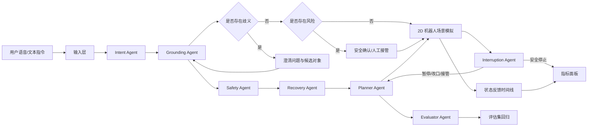

# Architecture

## V1.1 Architecture

## Modules

- Input Layer: 文本输入，浏览器支持时使用 Web Speech API。
- Intent Agent: 识别检查、递送、搬运、拿取放置等任务意图。
- Grounding Agent: 将自然语言里的对象、位置、指代词映射到场景实体。
- Scene Semantics: 为对象维护颜色、区域、类型、别名和坐标，用于模拟多模态 grounding。
- Safety Agent: 判断药品、重物、老人、门口、避障等风险。
- Recovery Agent: 预测执行中断，给出重规划、暂停等待、改目标或人工接管选项。
- Interruption Agent: 在执行中识别用户暂停、改目标、换对象或接管，并取消未完成动作。
- Planner Agent: 生成技能序列和任务步骤。
- Evaluator Agent: 估计执行置信度，并支持评估集回归。
- Clarification Manager: 管理对象歧义、位置歧义、指代不明。
- Safety Gate: 管理药品、重物、门口区域、靠近老人等高风险动作。
- Simulator: 用 2D 场景展示机器人移动和对象状态变化。
- Metrics: 记录完成率、澄清、确认、接管、风险拦截、异常恢复和中途打断。

## Future Architecture

后续可以扩展为：

- ASR/TTS: 实时语音输入输出。
- VLM: 视觉场景理解和对象定位。
- LLM Agent: 结构化任务解析、工具调用、澄清问题生成。
- Robot Skill API: 抓取、导航、递送、避障、检查等技能。
- ROS2 Bridge: 对接真实或仿真机器人。
- Evaluation Harness: 使用固定任务集回归测试 Agent 行为。
